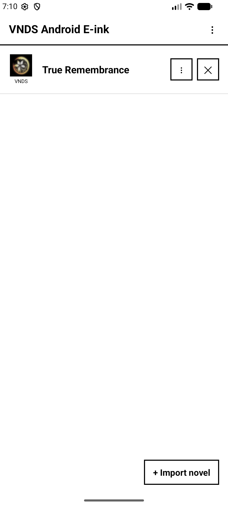
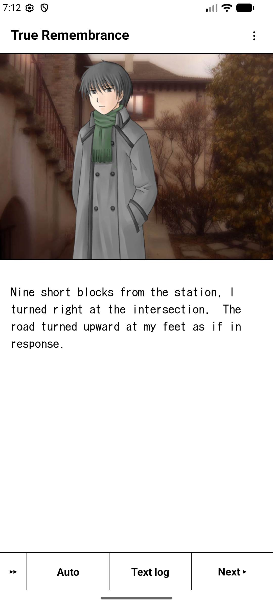

# VNDS Android E-ink

An Android visual novel reader purpose-built for e-ink devices, reading the classic **VNDS**
(`.scr`) script format used by the original Java ME / PC "VNDS" engine, as well as (with more
limited support, see [NScripter/ONScripter support](#nscripteronscripter-support)) the
**NScripter/ONScripter** script format. Rather than embedding either of those engines, this app
reimplements small interpreters for them from scratch, and every part of the UI is designed around
e-ink's constraints: no animations by default, instant image/text swaps, a forced light theme, and
grayscale-friendly rendering.

> Built for readers who want their visual novel library on a Boox/Onyx-style e-ink tablet or phone,
> not a backlit screen.

## Screenshots

<table>
<tr>
<td></td>
<td></td>
</tr>
<tr>
<td align="center">Library, with a story pack imported</td>
<td align="center">Reader mid-scene: background, character sprite, and dialogue</td>
</tr>
</table>

*(Story pack shown: [True Remembrance](https://en.wikipedia.org/wiki/True_Remembrance), a freeware
visual novel by Satomi Shiba, English translation by Insani — used here only to demonstrate the
reader; not bundled with this repo.)*

## Contents

- [Screenshots](#screenshots)
- [Features](#features)
- [Requirements](#requirements)
- [Building](#building)
- [Using the app](#using-the-app)
- [Supported VNDS script commands](#supported-vnds-script-commands)
- [NScripter/ONScripter support](#nscripteronscripter-support)
- [Completion guides](#completion-guides)
  - [Guide JSON format](#guide-json-format)
  - [Full example](#full-example)
  - [Field reference](#field-reference)
- [Project structure](#project-structure)
- [Contributing](#contributing)
- [License](#license)
- [Acknowledgments](#acknowledgments)

## Features

**E-ink first**
- No animations, fades, or transitions anywhere in the UI by default (toggleable) — every screen
  swap, image change, and text reveal is instant.
- Forced light theme and an optional grayscale color filter, regardless of system dark mode.
- Full-screen refresh (GC16-style flash) support on Onyx hardware to clear ghosting, both manual
  and automatic on scene changes.

**Library**
- Local-only library screen: nothing is scanned or re-imported automatically, everything is an
  explicit user action.
- Import a story pack three ways: a folder that may contain several packs, a folder that *is* one
  pack, or a single zip/7z archive of one pack.
- Auto-detects VNDS and NScripter/ONScripter packs alike at import time — no separate mode to pick;
  see [NScripter/ONScripter support](#nscripteronscripter-support) for how complete that support is.
- Optional VNDB linking per novel (manually entered VNDB id) for cover info, rating, and length,
  fetched from the public VNDB API.
- Export/import a novel's save data as a portable JSON file.

**Reader**
- Manual typewriter text reveal with a configurable speed (characters/second), skipped entirely in
  e-ink mode.
- Auto-advance with configurable reading speed (words/minute) and per-page pause.
- **Advance to next choice**: fast-forwards through the script without pausing for taps or scripted
  delays, without playing intermediate sound effects or music cues — only the last active music
  track (if any) actually plays once it stops.
- 24 manual save slots plus an always-current auto-managed "Resume" slot, presented as a paginated,
  e-ink-friendly grid.
- A **Variables** inspector: view and directly edit every current `setvar` (per-save) and `gsetvar`
  (global) script variable live, mid-story.
- A full text-log backlog, paginated by whole lines rather than raw scroll.
- Gamepad-friendly: volume keys and a paired controller's shoulder/select buttons advance text.

**Completion guides**

A structured, checkable walkthrough/completion tracker — routes, the choices that lead down them,
and the endings they lead to — importable as a JSON file per novel (see
[Completion guides](#completion-guides) below). Presented as a collapsible tree of checkboxes; your
progress is tracked independently of any save file, and the guide remembers which sections you had
expanded and your scroll position between visits.

Guides can also exist **standalone**, on their own dedicated "Guides" page (switchable to from the
library's ⋮ menu) — for reference material about a VN you haven't imported into this app. Add an
entry either by linking a VNDB id (for cover-style metadata) or by just typing a plain name, no
VNDB lookup required.

## Requirements

- Android 7.0 (API 24) or newer.
- Onyx/Boox e-ink hardware is fully supported but not required — everything works (with real
  animations, if you want them) on any Android device.

## Building

Standard Gradle project, single module (`app`).

```bash
# Debug APK
./gradlew assembleDebug

# Install on a connected device/emulator
./gradlew installDebug

# Unit tests
./gradlew testDebugUnitTest

# Instrumented tests (needs a device/emulator)
./gradlew connectedDebugAndroidTest

# Lint
./gradlew lint
```

`compileSdk`/`targetSdk` 37, `minSdk` 24, Java 11 source/target compatibility.

## Using the app

1. From the library screen, tap **+ Import novel** and choose how the pack is packaged (a tree that
   may hold multiple novels, a folder that *is* one novel, or a zip/7z archive).
2. Tap a novel to start reading. If it has any save data, you'll be asked whether to start fresh,
   resume, or load a specific save.
3. The reader's hamburger menu (⋮) has Save, Load, Advance to next choice, Settings, Variables, a
   completion Guide (if one's imported), a manual e-ink refresh (Onyx hardware only), and
   Library/Quit.
4. A novel's row menu on the library screen (⋮ on that row) offers VNDB linking, save export/import,
   and completion-guide import.
5. The library's own three-dot menu (top-right) can switch to the separate **Guides** page for
   standalone guides not tied to an imported novel.

## Supported VNDS script commands

The interpreter (`vnds/ScriptEngine.java`) supports the documented VNDS `.scr` command set:

| Command | Usage | Notes |
|---|---|---|
| `text` | `text string` | `@`-prefixed = non-blocking; `~` = blank line; `!` = blank + blocking tap |
| `bgload` | `bgload file [fadetime]` | Looks in `background/`; no fade on e-ink |
| `setimg` | `setimg file x y` | Looks in `foreground/`; layers stack, never replace |
| `sound` | `sound file times` | `times = -1` loops forever; `~` stops the current sound |
| `music` | `music file` | `~` stops music |
| `setvar` / `gsetvar` | `setvar name = /+/- value` | `setvar` is per-save; `gsetvar` is global |
| `choice` | `choice a\|b\|c` | Sets `selected` to the 1-based picked index |
| `if` / `fi` | `if var == value ...` | Flat (non-nested) conditional |
| `label` / `goto` | | Same-file jump |
| `jump` | `jump file.scr [label]` | Switches script file, optionally to a label |
| `delay` | `delay frames` | Real pause, unless e-ink's "instant delays" setting is on |
| `random` | `random var low high` | Inclusive range |

Unknown/unsupported commands are silently ignored, since real-world VNDS packs sometimes use
commands outside the documented set.

## NScripter/ONScripter support

Alongside VNDS, this app also has a second, independent interpreter
(`nscripter/NsScriptEngine.java` + `NsCommandDispatcher.java`) for the NScripter/ONScripter script
format — recognized automatically at import time from a plain-text `0.txt`/`00.txt` (or its
`.utf`-suffixed variants) or an obfuscated `nscript.dat`/`pscript.dat`/`nscr_sec.dat`, typically
alongside an `arc.nsa` asset archive.

**Support here is more limited than for VNDS, and not every NScripter/ONScripter novel will work
correctly.** This engine covers a core subset of real-world commands — dialogue and inline text
control codes, backgrounds/sprites, choices and the custom-select (`csel`/`cselbtn`) menu idiom,
sound/music, numeric/string variables and `if`/`for` control flow, `defsub`/`getparam`
pseudo-commands, and more — but real NScripter/ONScripter games vary widely in which commands,
extensions, and engine-specific quirks they lean on, and this reimplementation doesn't cover all of
them. As with the VNDS interpreter, an unrecognized command is silently skipped rather than crashing
the reader, so most scripts keep running even when something isn't fully supported — but depending
on what a given novel relies on, you may see things like unparsed script syntax showing up as
dialogue, a scene or menu that doesn't advance, or missing effects. If you run into one of these
with a specific novel, please open an issue with enough detail to reproduce it.

## Completion guides

A completion guide is a plain JSON file describing a VN's routes, the choices along each one, and
the endings they lead to — the kind of information a text walkthrough already contains, structured
so the app can render it as a checkable tree instead of a wall of text.

Import one from a novel's row menu ("Import guide…") to attach it to that novel, or from the
separate Guides page to keep a guide independent of any imported story. Either way, the *file*
itself is never modified — every checkbox you tick is tracked by the app separately, keyed to the
novel/entry, and is completely independent of any save slot.

### Guide JSON format

The parser is deliberately permissive: only a top-level `"routes"` array is required, every other
field is optional, and unrecognized fields are simply ignored (so a richer, hand-maintained guide
degrades gracefully in older app versions, and vice versa). Two shapes of `"prerequisiteEndings"`
are both understood (see the field reference below) since real-world walkthrough data isn't
consistent about it.

### Full example

```json
{
  "game": "Example Visionary Tale",
  "source": "Written by hand as a schema example for this README",
  "rating": "All ages",
  "generatedNote": "Not scraped from a real walkthrough -- purely illustrative",
  "trueEndNote": "The Grand Ending requires every other ending first",
  "recommendedOrderNote": "Play Aria's route before Bram's -- Bram's route assumes Aria's is done",

  "saveSlots": [
    { "id": "001", "createdIn": "common route", "usedToStart": ["aria", "bram"], "created": false }
  ],

  "routes": [
    {
      "id": "aria",
      "name": "Aria's Route",
      "category": "Main Routes",
      "recommendedOrder": 1,
      "prerequisiteRoutes": [],
      "checkpoints": [
        {
          "afterEvent": "The rooftop conversation",
          "choices": [
            { "num": 1, "text": "Stay and talk with Aria.", "passed": false },
            { "num": 2, "text": "Go back inside.", "passed": false, "saveHereFor": "aria_bad" },
            {
              "num": 3,
              "text": "About the transfer student.",
              "characterSelectChoice": true,
              "branchesTo": "bram",
              "note": "Auto-selected on a first playthrough; picking it manually shifts into Bram's route early.",
              "passed": false
            }
          ]
        },
        {
          "afterEvent": "The festival",
          "choices": [],
          "unenumeratedChoices": 12,
          "note": "A dozen minor flavor choices here, none of which affect the ending."
        }
      ],
      "endings": [
        {
          "id": "aria_good",
          "name": "Aria - Good End",
          "type": "good",
          "obtainedBy": "Reached by choosing option 1 at the rooftop.",
          "completed": false
        },
        {
          "id": "aria_bad",
          "name": "Aria - Bad End",
          "type": "bad",
          "pivotalChoice": {
            "text": "Go back inside.",
            "pick": true,
            "note": "The choice that locks in the bad end."
          },
          "completed": false
        }
      ]
    },
    {
      "id": "bram",
      "name": "Bram's Route",
      "category": "Main Routes",
      "recommendedOrder": 2,
      "prerequisiteRoutes": ["aria"],
      "prerequisiteEndings": { "requireOneOf": ["aria_good", "aria_bad"] },
      "prerequisiteNote": "Unlocks after finishing Aria's route with either ending.",
      "unlocksOnCompletion": ["grand_ending"],
      "checkpoints": [
        {
          "choices": [
            { "text": "Confront Bram directly.", "passed": false },
            { "text": "Wait and see what happens.", "passed": false }
          ]
        }
      ],
      "endings": [
        {
          "id": "bram_good",
          "name": "Bram - Good End",
          "type": "good",
          "pivotalChoiceSequence": [
            { "text": "Confront Bram directly.", "pick": true },
            { "text": "Forgive him.", "pick": true, "note": "The final, deciding line." }
          ],
          "completed": false
        }
      ]
    },
    {
      "id": "grand_ending",
      "name": "Grand Ending",
      "category": "Bonus",
      "recommendedOrder": 3,
      "prerequisiteRoutes": ["aria", "bram"],
      "prerequisiteEndings": ["aria_good", "bram_good"],
      "accessedVia": "Unlocks on the title screen once every other ending is completed.",
      "onlyOneEnding": true,
      "onlyOneEndingNote": "Unlike the other routes, there's just this one ending here.",
      "checkpoints": [],
      "endings": [
        { "id": "grand_end", "name": "Grand Ending", "type": "true", "completed": false }
      ]
    }
  ]
}
```

### Field reference

**Top level**

| Field | Type | Notes |
|---|---|---|
| `routes` | array | **Required.** See *Route* below. |
| `game` | string | Shown as the guide dialog's title. |
| `saveSlots` | array | See *Save slot* below. Optional; a Never7-style walkthrough convention (numbered save slots as waypoints between routes), not needed for guides that don't use them. |
| `recommendedOrderNote` | string | Free text shown under the title. |
| `source`, `rating`, `generatedNote`, `trueEndNote` | string | Joined into one "about this guide" line under the title. |

**Route**

| Field | Type | Notes |
|---|---|---|
| `id` | string | Stable identifier; also the prefix used to key this route's choices/endings for progress-tracking. Defaults to `"route" + index` if omitted. |
| `name` | string | Display name. Defaults to `id`. |
| `category` | string | Shown as a subtitle under the route name (e.g. "Near Side of the Moon"). |
| `recommendedOrder` | number | Routes are sorted by this ascending; routes without it keep their original array order, sorted after any that do have it. |
| `prerequisiteRoutes` | array of strings | Other routes' `id`s this one requires; shown as an info line. |
| `prerequisiteEndings` | array of strings **or** object | Either a flat array of ending `id`s (treated as "requires all of these"), or `{ "requireOneOf": [...], "requireAll": [...] }` for a mix of the two. |
| `unlocksOnCompletion` | array of strings | Other routes' `id`s this one unlocks; shown as an info line. |
| `prerequisiteNote` | string | Free text shown as an info line verbatim. |
| `accessedVia` | string | How the route is reached (e.g. a main-menu option); shown as "Access via: …". |
| `onlyOneEnding` | boolean | If true, shows `onlyOneEndingNote` (or a generic fallback line) noting the route has just one ending. |
| `onlyOneEndingNote` | string | Custom text for the above. |
| `checkpoints` | array | See *Checkpoint* below. |
| `endings` | array | See *Ending* below. |

**Checkpoint** (an item inside a route's `checkpoints` array)

| Field | Type | Notes |
|---|---|---|
| `afterEvent` | string | Shown as a small sub-heading above this checkpoint's choices. If omitted and the route has more than one checkpoint, a synthesized "Checkpoint N" is used instead. |
| `choices` | array | See *Choice* below. |
| `unenumeratedChoices` | number | If > 0, shows an inert "+N more choices not itemized" line (for walkthroughs that don't enumerate every minor choice). |
| `note` | string | Free text; appended to the unenumerated-choices line, or shown alone if there isn't one. |

**Choice** (an item inside a checkpoint's `choices` array)

| Field | Type | Notes |
|---|---|---|
| `text` | string | The choice's own text, shown as the checkbox row's label. |
| `num` | number | If present, prefixes the label as `"N. text"` (matches how some walkthroughs number choices). |
| `passed` | boolean | Seeds this choice's checked state **the first time** the guide is imported for a given novel/entry — never overwrites progress you've already tracked on a re-import. |
| `characterSelectChoice` | boolean | Flags an auto-selected/first-playthrough-only choice; shown as a "Character-select choice" note. |
| `saveHereFor` | string | Notes which ending a save made at this point is for; shown as "Save here for: …". |
| `branchesTo` | string | Notes which other route this choice branches into; shown as "Branches to: …". |
| `note` | string | Free text, appended to the same secondary detail line as the above. |

**Ending** (an item inside a route's `endings` array)

| Field | Type | Notes |
|---|---|---|
| `id` | string | Stable identifier, used to key this ending's progress (prefixed with the route's own `id`). Defaults to `routeId + "_ending" + index`. |
| `name` | string | Display name. Defaults to `id`. |
| `type` | string | Shown in parentheses after the name (e.g. "(true)", "(good)", "(bad)"). |
| `completed` | boolean | Seeds this ending's checked state on first import, same rule as `passed` above. |
| `loadSave` | string | A save-slot id (see *Save slot*) this ending is reached from; shown as "Load save …". |
| `pivotalChoice` | object | A single `{ text, pick, note }` step describing the deciding choice for this ending. Ignored if `pivotalChoiceSequence` is also present and non-empty. |
| `pivotalChoiceSequence` | array of the above | Multiple deciding steps in order, rendered joined by an arrow. |
| `obtainedBy` | string | Free-text alternative/supplement to the structured fields above. |
| `note` | string | Free text, appended after everything else. |

A `pivotalChoice`/`pivotalChoiceSequence` step's own fields: `text` (the choice's wording), `pick`
(boolean, default `true` — set to `false` to mean "pick the *other* option here"), and an optional
`note`.

**Save slot** (an item inside the top-level `saveSlots` array — optional, only meaningful for
walkthroughs that structure themselves around numbered save points)

| Field | Type | Notes |
|---|---|---|
| `id` | string | The slot's own label/number. Defaults to its array index. |
| `createdIn` | string | Which route this save was made in; shown in the row label. |
| `usedToStart` | array of strings | Which routes this save is used to start; shown in the row label. |
| `created` | boolean | Seeds this slot's checked state on first import, same rule as `passed`/`completed` above. |

## Project structure

- `app/src/main/java/com/example/vndsandroideink/` — the app itself (activities, dialogs, managers).
- `app/src/main/java/com/example/vndsandroideink/vnds/ScriptEngine.java` — the `.scr` interpreter,
  the one piece of the codebase with no Android dependency at all.
- `app/src/main/java/com/example/vndsandroideink/nscripter/` — the NScripter/ONScripter
  interpreter (see [NScripter/ONScripter support](#nscripteronscripter-support)).

## Contributing

Issues and pull requests are welcome. If you're changing the reader or importer, please test
against at least one real VNDS story pack of your own (and, if you're touching the `nscripter`
package, a real NScripter/ONScripter pack too) before submitting.

## License

[GNU General Public License v3.0](LICENSE) or later.

This is only the app's own code — it does not affect the licensing of any VNDS story pack, guide
file, or other content you import or use with it.

## Acknowledgments

- The original **VNDS** engine and its `.scr` script format, documented by Digital-Haze.
- **NScripter**, created by Ogapee, and **[ONScripter-EN](https://github.com/Galladite27/ONScripter-EN)**,
  the open-source engine derived from it — this app's own `nscripter` package is an independent
  reimplementation of that script format, consulted against ONScripter-EN's public source purely as
  a reference for real-world command semantics (see the LICENSE file's Third-Party Notices; no
  ONScripter-EN code is included in or distributed with this repository).
- [VNDB](https://vndb.org) for the metadata API used by the optional "Get info from VNDB" linking.
